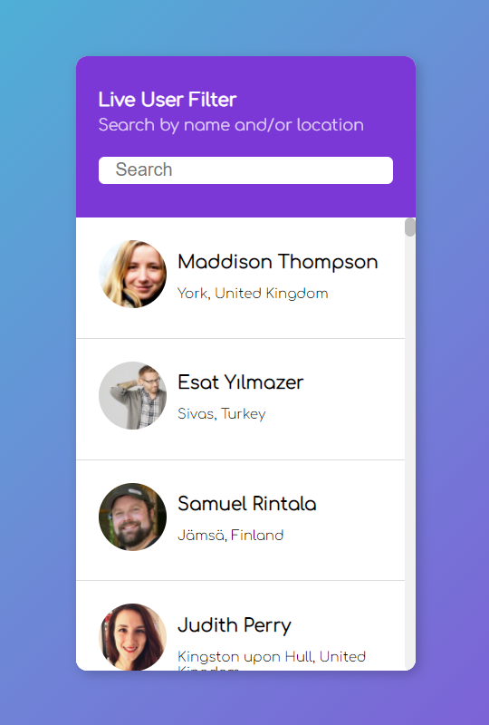
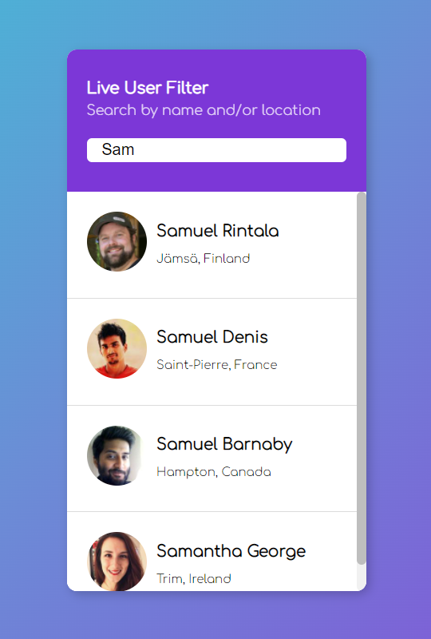

# JS-UserFilter

Live filtering users by name / location fetched via [RandomAPI](https://randomuser.me/).

500 random users were fetched for this project using ```fetch('https://randomuser.me/api?results=500')```.

## Screenshots

|  User Interface                               |  User Filter                            |
:----------------------------------------------:|:---------------------------------------:|
      |   |
